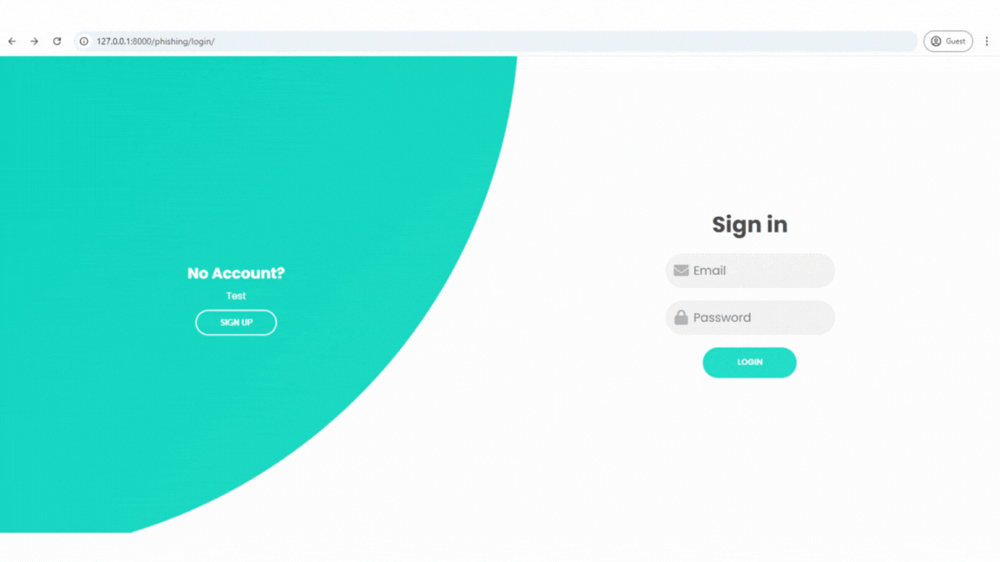
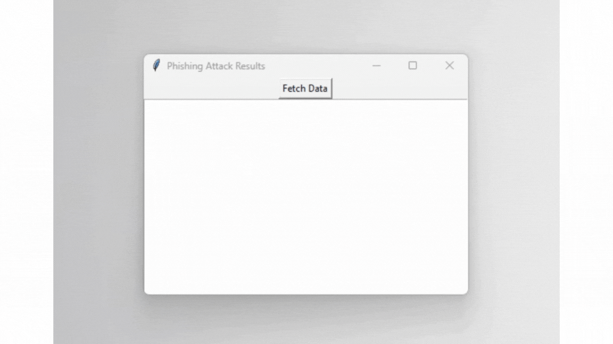
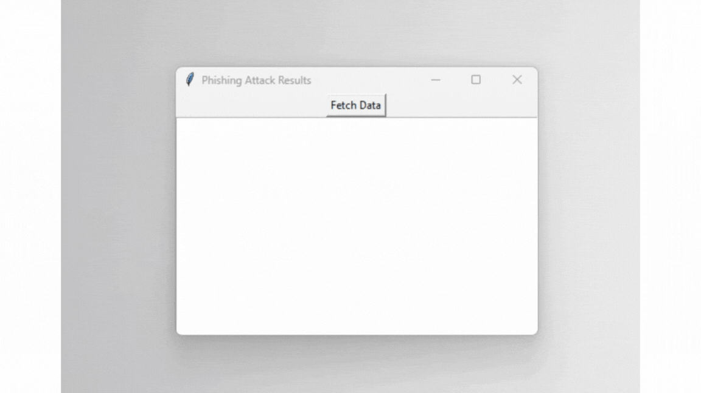

# Phishing Simulator

## About the app
This Desktop Application was developed for educational purposes to simulate phishing attacks by cloning the login page of a website and fetching user login credentials.

## How to use and what you need
* The **`requirements.txt`** file specifies the primary libraries used in the project:
    * **tkinter**: Used for creating the GUI.
    * **Django**: Used for cloning the target website.
    * **sqlite3**: Used for retrieving data from the SQLite3 database.

* To run the application, please follow these steps:
    * **Follow the tutorial**: Refer to the `tutorial.txt` file for detailed instructions.

## Basic usage
1. Create a Python virtual environment.
2. Activate the virtual environment.
3. Install the required libraries using **`pip install -r requirements.txt`**.
4. Start the cloned website using the command **`python manage.py runserver`**.
5. Open a new terminal and start the Desktop Application using the command **`python main.py`**.
6. To stop the Django website, press **`Ctrl + C`**.
7. To close the Phishing application, either click the close button in the top-right corner or press **`Ctrl + C`**.

## Introduction to the website
This project simulates a phishing attack, comprising two main components: a website component that mimics a phishing website, and a Desktop Application that fetches user login credentials when they log in through the simulated website. Upon successful login and data retrieval, the application displays the captured username and password.

## Website details
When the website is opened, it will appear as shown in the image

If a user logs in through the website, the web page will appear as shown in the image

After the login data is captured, when the Phishing Application is opened, it will appear as shown in the image.

After the login data is captured and the "Fetch Data" button is clicked, the login data entered by the user will appear as shown in the image.

### Postscript
This project is intended for educational purposes only, focusing on the study of phishing attacks and basic library usage. The developers have no intention of using this project for illegal activities. Finally, we would like to thank everyone who has viewed this project. Any suggestions are welcome. Thank you.